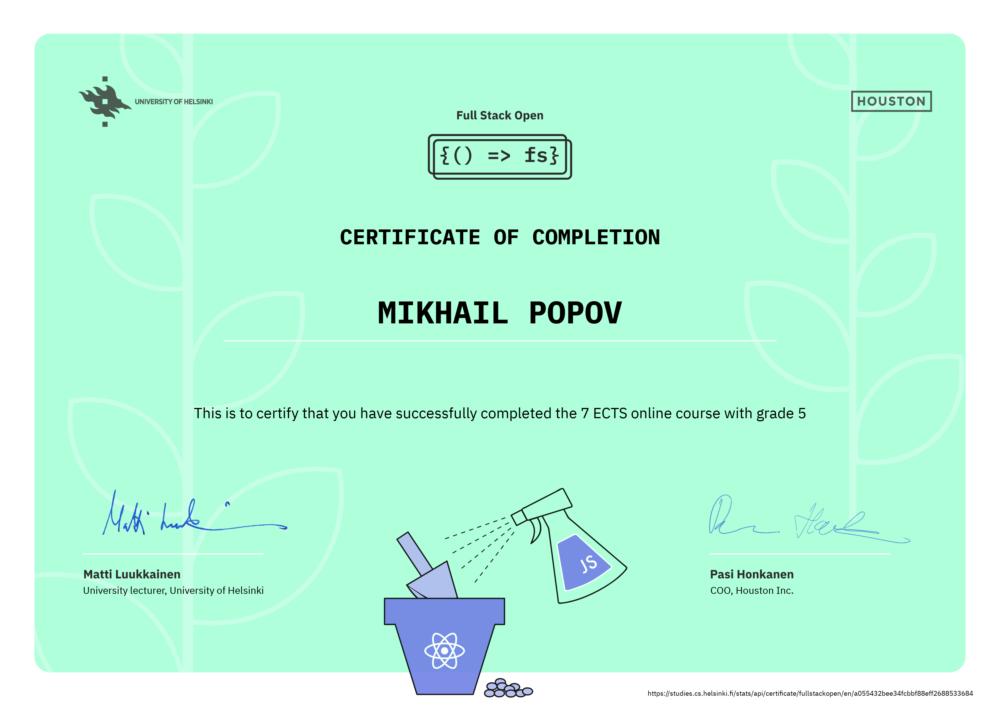
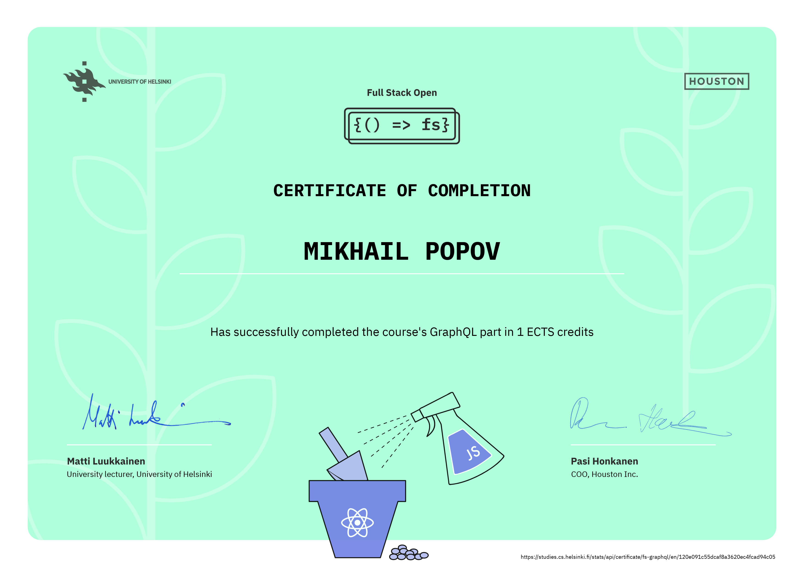

# Full Stack Open 2022
This repository contains exercise submissions for parts 0-9 of [fullstackopen.com](https://fullstackopen.com/) course by the [University of Helsinki](https://www.helsinki.fi/).

## Subsequent parts
Links to submission repositories of the subsequent parts of the course:

- [Part 11. CI/CD](https://github.com/cmd-mish/fullstackopen-part11)
- [Part 12. Containers](https://github.com/cmd-mish/fullstackopen-part12)
- [Part 13. Using relational databases](https://github.com/cmd-mish/fullstackopen-part13)

## Certificates

